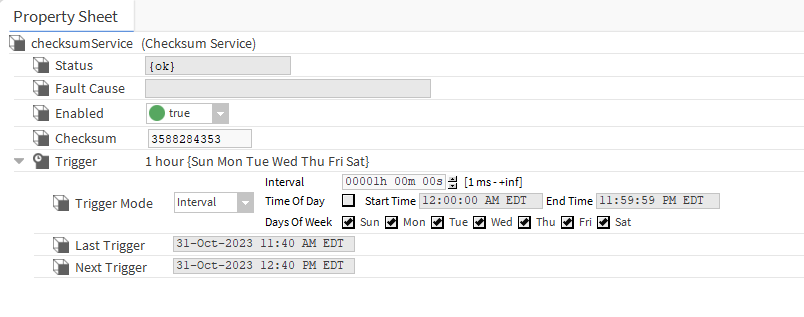

# Exercise 5: Checksum Service
In this exercise, you will create a Service that computes a checksum of the component tree of a station.

## Description
Create a new Service with a Property named `checksum` and an Action named `generateChecksum`. When the `generateChecksum` Action is invoked, the Service should scan the entire component tree of the station and compute a checksum for it. This checksum should be stored in the Service `checksum` Property.

If no components have been added to or removed from the station component tree since the checksum was last generated, the checksum should not change. Note that this means the checksum should not change when component Property values change (such as the `out` Property of a NumericWritable). It's up to you to decide how to generate the checksum. If you'd like, [here](https://www.baeldung.com/java-checksums) is an article from Baeldung on how to use Java's `CRC32` class.

Since scanning the component tree can be an expensive operation depending on the size of the station, make sure that `generateChecksum` runs on its own thread. It's up to you to decide how to create that thread.

Finally, remember that all services come with an `enabled` Property. Make sure that your implementation of `generateChecksum` honors this Property. In other words, don't do anything if `enabled` is `false`.

## Recommended Steps
Try to implement the behavior described above without reading this section. If you need a nudge in the right direction, here are some recommended steps.

1. Create a new Service and add the necessary annotations. Remember to extend the necessary class to make your class a Service.
2. Create a recursive method that, given a component, processes that component for inclusion in the checksum and calls itself on all of that component's child components (`BComponent#getChildComponents` will be helpful here). For instance, consider building up a string of each component's handle.
3. Implement the `generateChecksum` Action to check if `enabled` is `true`. If so, call your recursive method on the root of the station component tree (a handy way to get the root of the component tree is `Sys.getStation()`) and compute the checksum.
4. Once that's working, modify your `generateChecksum` Action implementation to run on a separate thread. The multithreading mechanism you use is up to you, although the easiest options are:
    * Create a Java `Thread` and start it when `generateChecksum` is invoked.
    * Create a subclass of `BSimpleJob`, override its `run` method to compute the checksum, and create and submit your job to the Job Service when `generateChecksum` is invoked.
    * Create a subclass of `BWorker` and post invocations of `generateChecksum` to the worker (remember to make `generateChecksum` asynchronous with the `ASYNC` flag and to override the `post` method in your Service) 
5. Add your service to a station to test it. Here are some recommended tests:
   * Make sure that calling `generateChecksum` multiple times doesn't change the checksum (since you're not changing the component tree).
   * Try changing the value of a component and making sure the checksum is the same.
   * Add a component and make sure the checksum is different, then delete it and confirm that the checksum is the same as it was before the component was added.

## Added Challenge
For an added challenge, add a trigger to your class that allows the user to define a time interval and generate the checksum on a recurring basis at the end of each interval.

Use the `BTimeTrigger` class in the `control` module. This might be difficult if you haven't used `BTimeTrigger` before, so here is some help on how to get started:

1. Add a new Property to your class named `trigger` of type `control:TimeTrigger`.
2. `BTimeTrigger` has an Action named `fireTrigger` that is invoked at the end of each interval when the trigger fires. When your service starts, create a link using the `linkTo` method from the `fireTrigger` slot of `BTimeTrigger` to the `generateChecksum` slot on your component.
3. Add the `HIDDEN` flag to the `generateChecksum` Action to prevent users from being able to invoke the Action in Workbench. Users can still right-click on the `trigger` Property and manually invoke the `fireTrigger` Action, so we're not losing any functionality.
