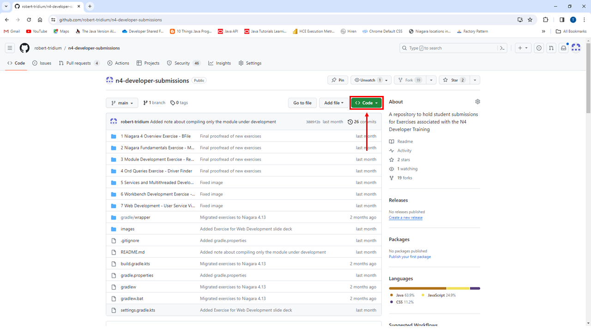
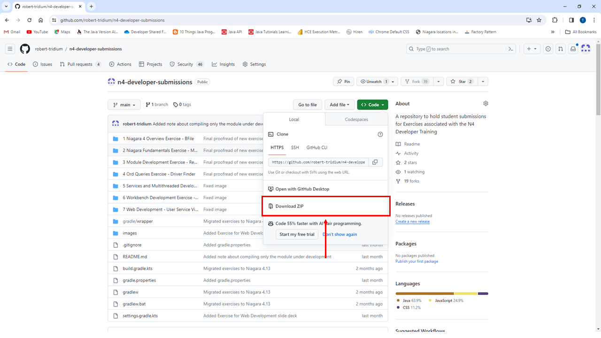
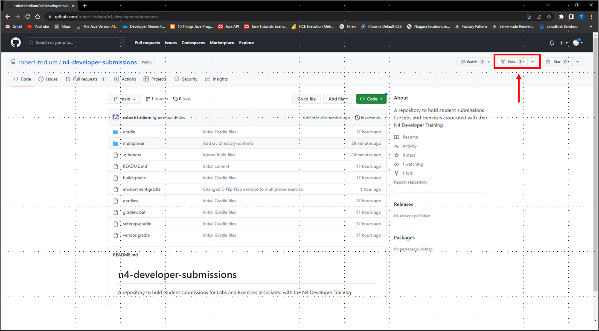
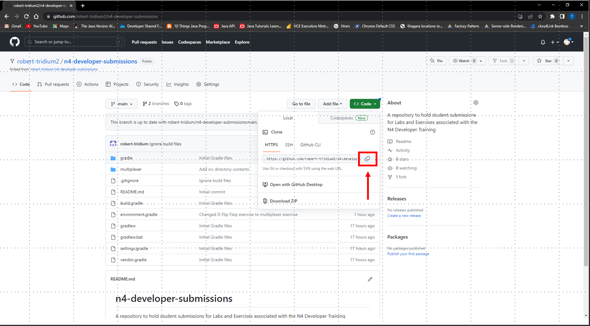
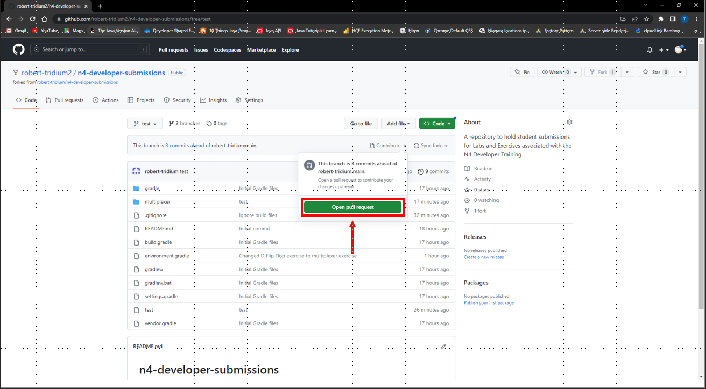

# n4-developer-submissions
This is a repository that will be used to hold submissions for exercises completed as part of the N4 Developer Training. These exercises are not mandatory, and submission is not mandatory even if you do the exercise.

## One-Time Steps
These steps only need to be completed once to get the repo onto your machine.

### Not Interested in Submitting
If you know that you won't be interested in submitting any of your work for code reviews and you want to use git and GitHub as little as possible, you can download this repository as a zipfile.
1. Login to GitHub and navigate to [this repo](https://github.com/robert-tridium/n4-developer-submissions).
2. Click the **Code** button.

3. In the resulting pop-up menu, click **Download ZIP**.

4. Extract the zipfile.
5. Edit the `gradle.properties` file as necessary for your machine. The `niagara_home` and `niagara_user_home` variables should have the same values for these exercises as they do for the labs in class. Also make sure that `nodeHome` is set to the location of your installation of Node.

### Interested in Submitting
If you might be interested in submitting your work for code review or if you want to try a more real-world git workflow, you can fork and clone this repository.
1. Login to GitHub and navigate to [this repo](https://github.com/robert-tridium/n4-developer-submissions).
2. Click **Fork** in the top right corner to create a fork of this repository in your own GitHub account.

3. Create a clone of your forked repository on your machine. One way to do this is to click the **Code** button in your forked repository, copy the shown URL, and run the command `git clone <forked_repo_url>` on your machine.

4. Edit the `gradle.properties` file as necessary for your machine. The `niagara_home` and `niagara_user_home` variables should have the same values for these exercises as they do for the labs in class. Also make sure that `nodeHome` is set to the location of your installation of Node.

## Steps for Each Exercise
These steps must be completed for each exercise you want to submit.

1. Navigate to the directory on your machine where you cloned your forked repository.
2. Create a new branch to hold your changes and check it out. One way to do this is with the command `git checkout -b <branch_name>`, where `<branch_name>` is something descriptive about the changes that will be on your branch.
4. Complete the exercise, including any coding, testing, etc.
5. When you're ready to submit your code for review, create one or more commits holding your changes. A simple way to do this is to run the command `git add .` from the repository root to add all of your changes to staging, then run the command `git commit -m "<commit_message>"` to make a commit containing your changes.
6. Push your commit(s) to your forked repository in GitHub with the command `git push`. If your local branch isn't tracking an upstream branch, you may need to use the command `git push --set-upstream origin <branch_name>`
7. In a web browser, navigate to your forked repository. Switch to the branch that you just pushed, then click the Contribute button and choose to open a Pull Request.

8. Fill out the Pull Request form and submit the Pull Request.
9. Your instructor will review your Pull Request and provide feedback on your code. Feel free to also look at other students' pull requests and the feedback on their code to get diverse ideas about how to solve the exercise!